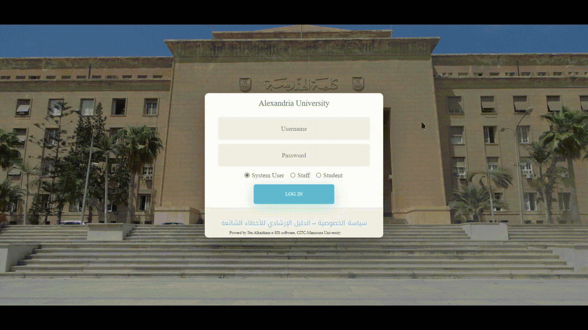

# Ibn-ElHaytham Registration Bot :robot:

Every Semester there is chaos in Alexandria University in the course registration process, and many students are left out of  some courses because they couldn't click fast enough as their fellow students.Want to escape from this chaos and give yourself the ease of mind of not being worried that you won't register with your friends.

## Table of Contents :bookmark_tabs:

- [Ibn-ElHaytham Registration Bot :robot:](#ibn-elhaytham-registration-bot-robot)
  - [Table of Contents :bookmark\_tabs:](#table-of-contents-bookmark_tabs)
  - [Introduction :clipboard:](#introduction-clipboard)
  - [Features :sparkles:](#features-sparkles)
  - [Demo 📸](#demo-)
  - [Installation :computer:](#installation-computer)
  - [Usage :arrow\_forward:](#usage-arrow_forward)
  - [Troubleshooting :interrobang:](#troubleshooting-interrobang)
  - [Contributing :handshake:](#contributing-handshake)
  - [License :page\_facing\_up:](#license-page_facing_up)

## Introduction :clipboard:


Introducing Ibn-ElHaytham Registration Bot your gateway to a hassle free registration process just tell it what courses you want and run it. It will work until you sucessfully managed to register. It streamlines the entire process and ensures you secure your desired courses without manual intervention. :robot_face:

## Features :sparkles:

- **Effortless Registration:** The bot takes care of the entire registration process, from logging in to selecting courses, and completing the registration. :white_check_mark:

- **Customizable Preferences:** You can configure the bot with your course preferences, such as which group or section or lab to ensure it registers the courses you want. :gear:

- **Error Handling:** Remember the famous "لم يبدأ التسجيل" it handles it gracefully ensuring it will pass it first  :exclamation:

## Demo 📸
<p align="center" width="100%">


</p>  
<div align="center">

## Installation :computer:

To install the Course Registration Bot, follow these steps:

1. Clone this repository to your local machine.
2. Navigate to the bot directory in your terminal.
3. Install the required dependencies by running: `pip3 install -r requirments.txt`. :package:

## Usage :arrow_forward:

To run the Course Registration Bot, execute the following command:

```
python -u "path_to_repo\gui.py
```

The bot will prompt you to provide your login credentials for your educational institution's registration system and the course you want to add.

Press the Go button and it will do it's magic

**Note:** It's essential to review and configure the bot's inputs in the  before running it. As any mistake might result in unsuccessful registration process :memo:


## Troubleshooting :interrobang:

If you encounter any issues or have questions, feel free to reach out to and drop the issue We are here to help you have a smooth registration experience. :raised_hands:

## Contributing :handshake:

We welcome contributions from the community to enhance the bot's functionality and make it even more efficient. :heart:
Provided Also a sample webpage that has the course registration tables

## License :page_facing_up:

The Course Registration Bot is licensed under the [MIT License](LICENSE). You are free to use, modify, and distribute this software as per the terms of the license. :scroll:

---

Happy Course Registration! :partying_face:

If you have any feedback or suggestions, please don't hesitate to let us know. We're continually working to improve the bot and provide you with the best registration experience possible. Enjoy your courses! :mortar_board:
